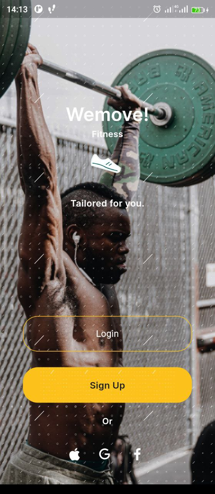
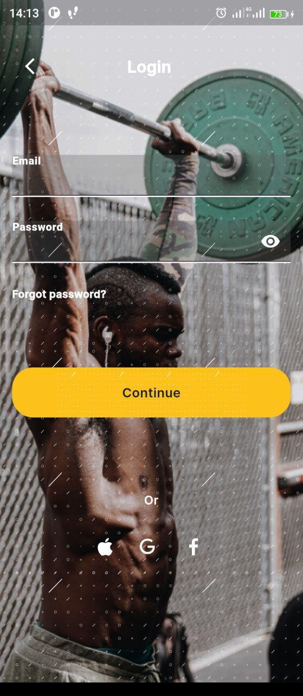
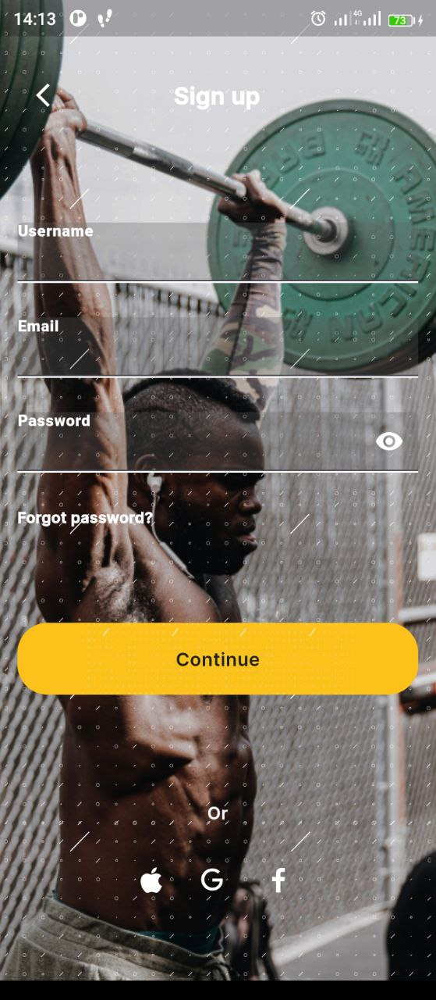
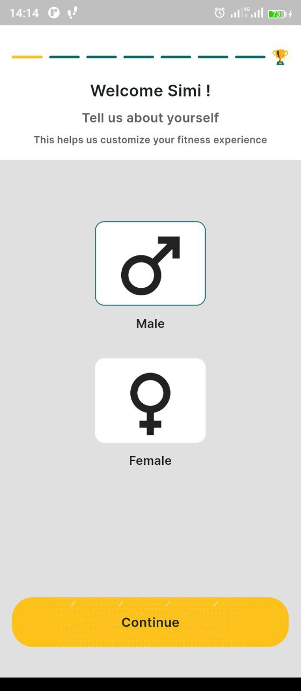
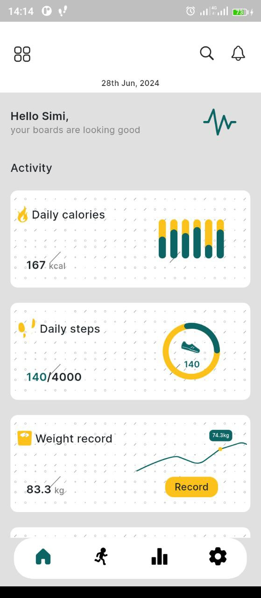
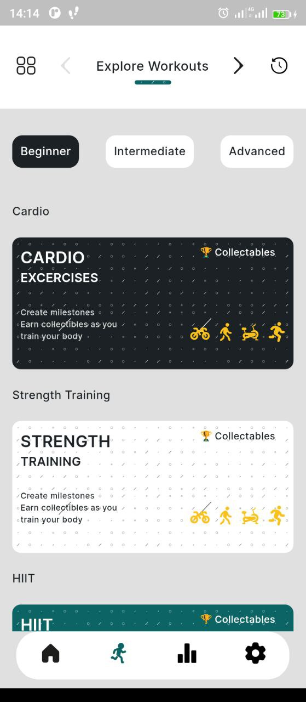
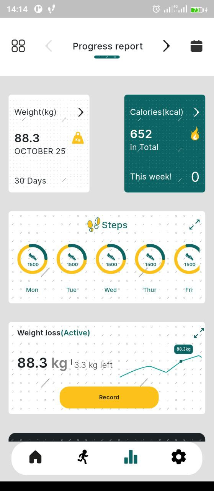
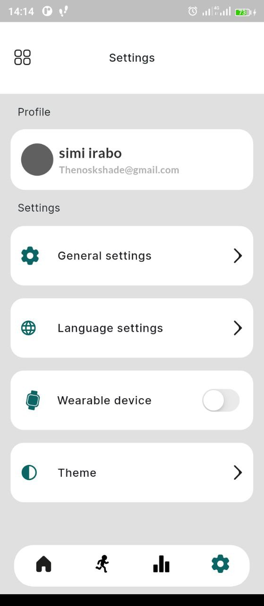

# Wemove Fitness Tracker App

## Table of contents

- [Screenshot](#screenshots)
- [Built with](#built-with)
- [Acknowledgements](#acknowledgements)

### Screenshots

    

   

### Built with

- Flutter
- Dart
- Riverpod for State Management
- GetX for Navigation

### Acknowledgements

- **Design**: The design for this app was created by [The Nosk](https://www.behance.net/thenoskshade).

- **Development**: The app was developed by [Jeremiah](https://github.com/JER3MIAH).
